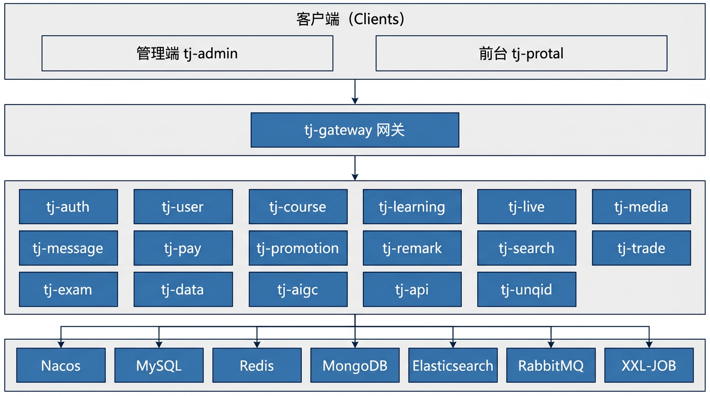

  

  <strong>智慧MOOC教育平台</strong>

  在线职业技能培训的一站式教学与运营平台

  
  
  
  

  <a href="#-项目介绍">项目介绍</a> ·
  <a href="#-核心特性">核心特性</a> ·
  <a href="#-项目架构">项目架构</a> ·
  <a href="#-技术栈">技术栈</a> ·
  <a href="#-项目资料">项目资料</a>

## 📖 项目介绍

智慧MOOC教育平台是一个在线的非学历职业技能培训平台，核心业务是以售卖各种技能培训的在线课程，并提供丰富的学习辅助功能、交互功能，以提升用户学习时的氛围感和学习的积极性。

**项目展示视频：**

- 用户端：https://www.bilibili.com/video/BV1NEb5zBEko
- 管理端：https://www.bilibili.com/video/BV1fdtRz6Efc
- 直播功能展示：https://www.bilibili.com/video/BV1zox9zPEX6

> JDK17 版本展示视频等功能基本完善再发布，敬请期待~

**JDK17 分支说明：** 本分支将项目由 JDK11 升级为 JDK17，并新增 **AIGC 模块、直播模块**。

## ✨ 核心特性

| 特性 | 说明 |
| ---------------------- | ------------------------------------------------------------ |
| **在线课程与学习体验** | 支持课程售卖、学习计划、进度统计等完整学习闭环，提升学习氛围和参与度。 |
| **AIGC 能力整合** | 基于 Spring AI 对接阿里云百炼平台，实现 AI 课程推荐、智能对话等。 |
| **多中心业务架构** | 按业务域拆分为课程中心、学习中心、消息中心、交易中心等模块。 |
| **高并发与高可用设计** | 通过缓存、消息队列、分布式锁、异步化等方案优化并发与性能。 |
| **可观测与运维友好** | 支持日志埋点、指标采集和监控大盘，便于问题定位与运维管理。 |

## 🏗️ 项目架构

## 🛠 技术栈

**核心技术栈：** Spring Boot、Spring Cloud Alibaba、Spring AI、MyBatis、MySQL、Redis、Redisson、Caffeine、RabbitMQ、XXL-JOB、腾讯云 VOD（视频点播）、Nginx、MongoDB 等

**中间件版本（当前环境）：**

- MySQL 8.0.29
- Redis 7.0.0
- Nacos 2.1.0
- Elasticsearch 8.13.4
- RabbitMQ 3.8
- Kibana 8.13.4
- XXL-JOB 2.3.0

**服务器与基础环境：**

- CentOS Linux release 7.9.2009 (Core)
- Docker 20.10.8

## 🧱 项目模块介绍

| 模块名称 | 模块定位 | 模块介绍 |
| ------------ | ---------- | ------------------------------------------------------------ |
| tj-aigc | AI 智能服务 | 实现平台内 AI 智能对话、知识库管理、AI 工具服务调用等操作 |
| tj-api | 接口服务 | 提供统一的 API 服务，方便内部系统跨服务调用功能 |
| tj-auth | 鉴权中心 | 负责平台的认证和授权相关功能，处理用户登录、权限验证等操作 |
| tj-common | 通用资源 | 存放项目通用的代码、工具类、常量等，供其他模块复用 |
| tj-course | 课程中心 | 管理课程相关业务，如课程的创建、编辑、展示、查询等 |
| tj-data | 数据中心 | 涉及管理端数据展板展示、基于网关日志进行数据分析、流量统计、报表生成等功能 |
| tj-exam | 考试中心 | 用于考试相关功能，包括考试管理、成绩记录等 |
| tj-gateway | 网关 | 作为网关，处理请求的路由、过滤、鉴权等，保障系统的安全和流量管理 |
| tj-learning | 学习中心 | 专注于学习相关业务，也包含用户学习的各种辅助功能 |
| tj-live | 直播中心 | 支持直播功能，如直播课程的创建、直播流管理、观众互动等 |
| tj-media | 媒资管理 | 用于管理媒体资源，如媒资、文件的管理存储 |
| tj-message | 消息中心 | 负责平台系统消息/通知推送、以及用户私聊、在线群聊的功能 |
| tj-pay | 支付中心 | 集成了多种支付方式，处理支付相关业务，如第三方支付或退款、支付方式管理、支付状态查询、对账等 |
| tj-promotion | 营销中心 | 管理平台的促销活动，如优惠券发放、折扣活动设置等 |
| tj-remark | 互动管理 | 用于处理评论、评价等相关功能，对点赞等操作进行专门统计存储 |
| tj-search | 搜索服务 | 提供搜索功能，支持用户对课程、资料等内容的搜索及提供个性化推荐 |
| tj-trade | 交易中心 | 处理交易相关业务，如订单管理、交易记录查询等 |
| tj-unqid | ID 生成服务 | 统一生成全局唯一 ID，方便业务调用 |
| tj-user | 用户中心 | 管理用户相关业务，如用户信息的增删改查、用户角色管理等 |

## 💻 前端模块介绍

注：前端模块在 tj-front 文件夹下

| 模块名称 | 模块定位 | 模块介绍 |
| ------------ | ------- | -------------------------- |
| tj-admin | 管理端 | 提供后台管理功能。只有后台用户、教师可以登录。 |
| tj-protal | 前台 | 围绕课程提供服务。只有学生端用户可以登录。 |

## 🧩 解决方案

本项目中包含的技术和解决方案有：

> 基于自定义注解和 Redisson 的分布式锁工具
>
> XXL-JOB 分布式任务调度工具
>
> Caffeine 本地缓存工具
>
> 支持可靠消息、延迟消息的 RabbitMQ 工具
>
> 延迟队列 DelayQueue
>
> 基于 CompletableFuture 和 CountDownLatch 的并发任务处理方案
>
> 高并发高精度的视频进度记录和回放解决方案
>
> 学习计划和学习进度统计的学习监督方案
>
> 通用的问答（评论）功能实现方案
>
> 通用、高性能的点赞系统解决方案
>
> 高性能、低存储成本的签到解决方案
>
> 实时性强、通用性好的积分排行榜、历史排行榜解决方案
>
> 支持大数据量、高性能校验的优惠券兑换码算法
>
> 基于 LUA 脚本的高性能、并发安全的优惠券领取解决方案（秒杀解决方案）
>
> 优惠券叠加的智能推荐算法（MapReduce 的思想）
>
> 基于 Redis 合并写请求并基于定时任务异步持久化的并发优化方案
>
> 基于 Redis 和 MQ 的异步写优化方案
>
> 基于腾讯 VOD 的视频加密、视频点播、视频审核、视频雪碧图功能
>
> 包含支付宝支付、微信支付的多平台支付系统
>
> 订单退款拆单处理方案
>
> 基于 Spring AI 对接阿里云百炼平台实现 AI 课程推荐、AI 对话等
>
> 集成 MongoDB、Redis、MySQL 等多异构数据源的数据存储方案
>
> 基于 Redis 的 Queue 将数据定时持久化到 MySQL 的解决方案
>
> 基于 Nginx 的 rtmp 模块实现平台级的直播推流方案
>
> 企业级 WebSocket 内存+Redis 统一连接管理方案

## ⚙ 环境配置

- **前端环境**：Node.js v17.8.0，NPM 8.5.5（或 PNPM 6.32.8）
- **后端环境**：Java 17 + Spring Boot 3.3.5 + Spring Cloud Alibaba 2023.0.3.2 + Spring AI 1.0.0

> 相关中间件的详细安装与部署说明可参考 [项目升级日志](项目升级日志.md)

## 📚 项目资料

本项目当前已有文档与资料目录如下：

- [`/nacos`](./nacos)：存储项目 Nacos 配置文件
- [`/sql`](./sql)：存储项目数据库表源文件（不带数据）
- [`/sql/test`](./sql/test)：存储项目数据库表（带测试数据）
- [项目升级日志](项目升级日志.md)：由 JDK11 升级到 JDK17 的改造笔记与扩展说明

## 📄 许可证

本项目采用 Apache License 2.0 许可证。

## ⭐ Star 历史

## 🧾 关于项目

项目由 JDK11 升级到 JDK17 的改造笔记请参考 [项目升级日志](项目升级日志.md)，每一步改造都包含当时的技术考量与取舍，主要用于系统性学习与实践总结。

如果您对项目有改造的想法、意见，或者您也想参与到项目代码的贡献，欢迎联系或私信我。

项目部署、代码问题或者一些定制化开发可前往我的**公众号**「正在绘制中」私信咨询，期待与你交流。

